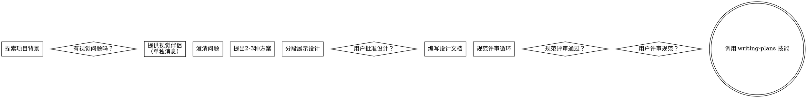

# 将想法转化为设计

通过对话协助将想法转化为完整的设计和规范。

首先理解当前项目背景，然后逐步提问以细化想法。当你明白要构建什么后，展示设计并获得用户批准。

<HARD-GATE>
在展示设计并获得用户批准前，禁止调用任何实现技能、编写代码、脚手架项目或采取任何实现行动。无论项目多简单，均需遵循。
</HARD-GATE>

## 反模式：“这太简单，不需要设计”

每个项目都要经过此流程。即使是待办事项列表、单函数工具或配置更改也不例外。简单项目更容易因假设未检验而浪费工作。设计可以很短，但必须展示并获得批准。

## 检查清单

你必须为以下每项创建任务并按顺序完成：

1. **探索项目背景** —— 检查文件、文档、最近提交
2. **提供视觉伴侣**（如涉及视觉问题）—— 单独发送消息，不与澄清问题合并
3. **逐步澄清问题** —— 理解目的、约束、成功标准
4. **提出2-3种方案** —— 说明权衡并给出推荐
5. **分段展示设计** —— 按复杂度分段，逐段获得用户批准
6. **编写设计文档** —— 保存至 `docs/superpowers/specs/YYYY-MM-DD-<topic>-design.md` 并提交
7. **规范评审循环** —— 调用 spec-document-reviewer 子代理，精确传递评审上下文（不使用会话历史）；修正问题并重新评审，最多3轮，未通过则交由人工处理
8. **用户评审规范** —— 请用户评审规范文件后再继续
9. **转入实现阶段** —— 调用 writing-plans 技能生成实现计划

## 流程图

## 反模式警示

“项目太简单不需要设计”是常见误区。每个项目都应经过设计和评审流程。
