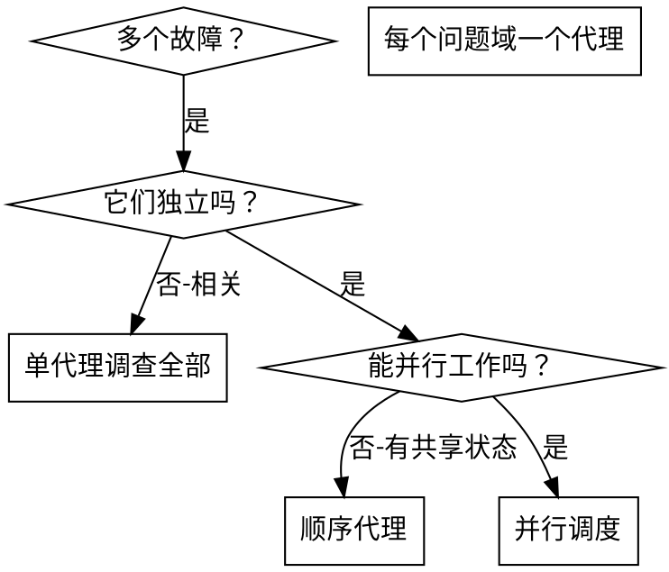

# 并行代理调度

## 概述

你将任务委托给具有独立上下文的专用代理。通过精确编写指令和上下文，确保代理专注于任务并取得成功。代理不应继承你的会话上下文或历史——你只传递他们所需的信息。这也有助于你自己进行协调。

当有多个无关故障（不同测试文件、子系统、bug）时，顺序调查会浪费时间。每个调查都是独立的，可以并行进行。

**核心原则：** 每个独立问题域分配一个代理，让他们并发工作。

## 适用场景

**适用：**
- 3个及以上测试文件因不同原因失败
- 多个子系统独立损坏
- 每个问题可独立理解
- 各调查间无共享状态

**不适用：**
- 故障相关（修复一个可能影响其他）
- 需理解完整系统状态
- 代理间会互相干扰

## 模式步骤

1. 识别独立问题域
2. 为每个域分配代理
3. 精确传递上下文，避免污染
4. 并行执行，收集结果
