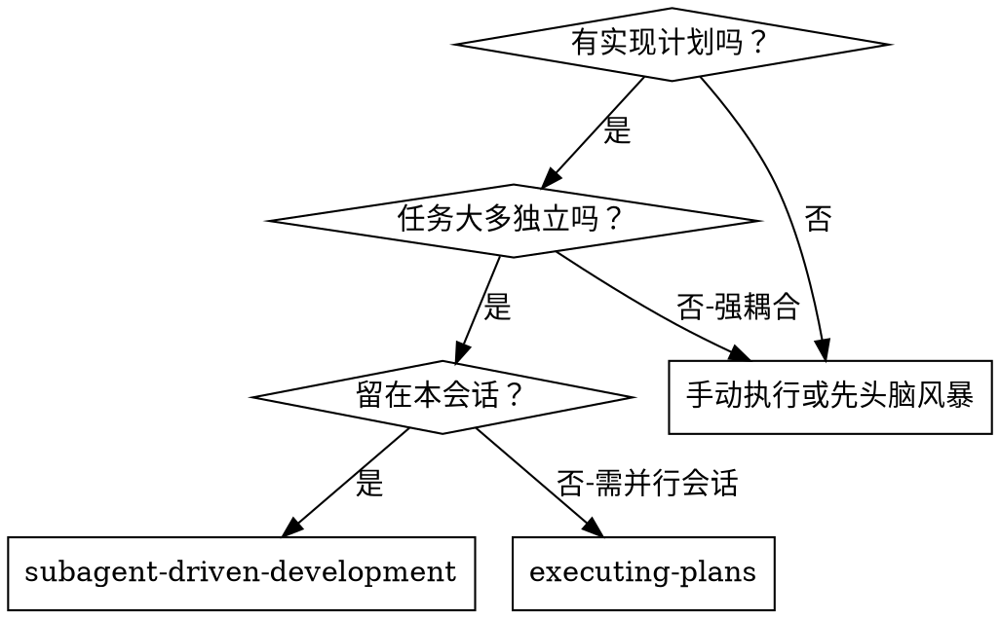
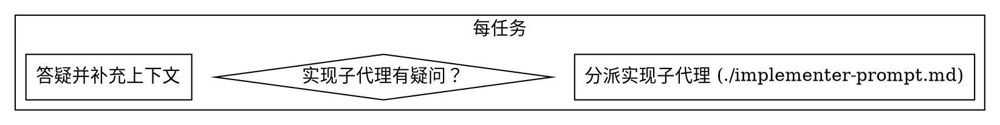

# 子代理驱动开发

通过为每个任务分派全新子代理，并在每步后进行两阶段评审（规范合规→代码质量），高效高质地执行计划。

**为何用子代理：** 你将任务委托给专用代理，精确传递上下文，确保专注且高效。代理不继承你的会话历史，避免上下文污染，也便于你自己协调。

**核心原则：** 每任务新子代理 + 两阶段评审 = 高质量、快迭代

## 适用场景

**与 executing-plans（并行会话）的区别：**
- 同一会话（无上下文切换）
- 每任务新子代理（无上下文污染）
- 每步后两阶段评审：先规范合规，再代码质量
- 迭代更快（任务间无需人工介入）

## 流程

（后续流程可补充）
