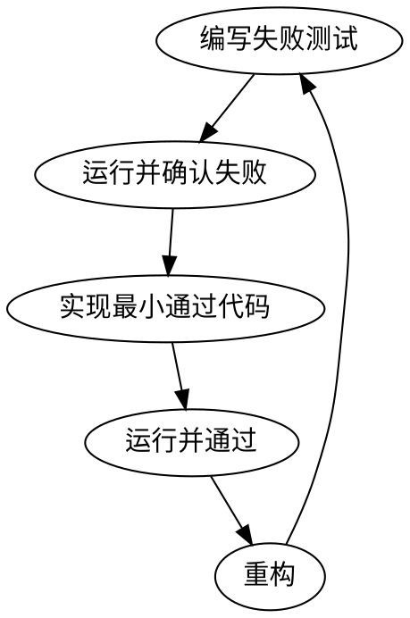

# 测试驱动开发（TDD）

## 概述

先写测试，观察其失败，再写最少代码使其通过。

**核心原则：** 如果你没见过测试失败，就无法确定测试是否有效。

**违反规则即违反 TDD 精神。**

## 适用场景

**总是适用：**
- 新功能
- Bug 修复
- 重构
- 行为变更

**例外（需征得人类同意）：**
- 一次性原型
- 生成代码
- 配置文件

觉得“这次可以不 TDD”？停下，这只是自我安慰。

## 铁律

```
未有失败测试，禁止写生产代码！
```

先写代码再写测试？删掉，重来。

**无例外：**
- 不保留作“参考”
- 不“边写边补”
- 不偷看实现
- 必须彻底删除

一切从测试出发。

## 红-绿-重构



（后续内容可补充）
