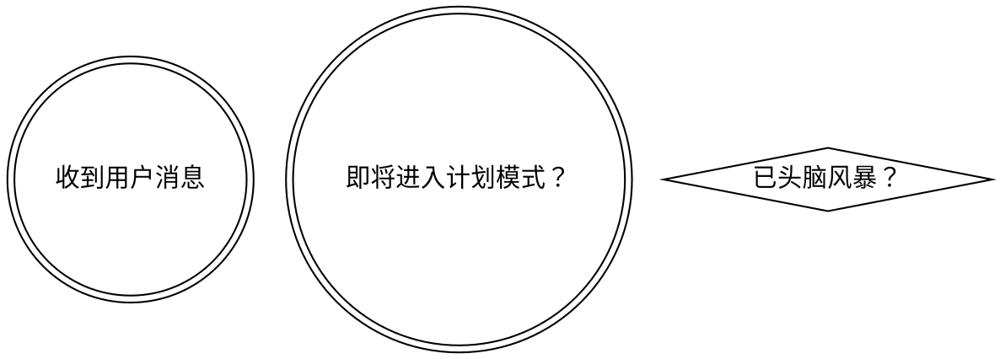

<SUBAGENT-STOP>
如你被派为子代理执行特定任务，可跳过本技能。
</SUBAGENT-STOP>

<极其重要>
只要有 1% 可能适用技能，你就必须调用技能。

如技能适用，你没有选择权，必须使用。

这不是协商，不可理性化解释。
</极其重要>

## 指令优先级

Superpowers 技能优先于默认系统提示，但**用户指令始终最高优先级**：

1. **用户显式指令**（CLAUDE.md、GEMINI.md、AGENTS.md、直接请求）——最高
2. **Superpowers 技能**——如与系统冲突则覆盖
3. **默认系统提示**——最低

如 CLAUDE.md、GEMINI.md、AGENTS.md 指定“不要用 TDD”，而技能要求“必须用 TDD”，应遵循用户指令。用户拥有最终控制权。

## 如何访问技能

**在 Claude Code：** 用 `Skill` 工具。调用技能时，其内容会被加载并展示——直接遵循。

**在 Gemini CLI：** 用 `activate_skill` 工具。Gemini 会在会话开始加载技能元数据，按需激活完整内容。

**其他环境：** 查阅平台文档。

# 使用技能

## 规则

**在任何响应或行动前，先调用相关或被请求的技能。** 只要有 1% 可能适用，就应调用技能确认。如发现不适用，可不使用。

（后续内容可补充）
